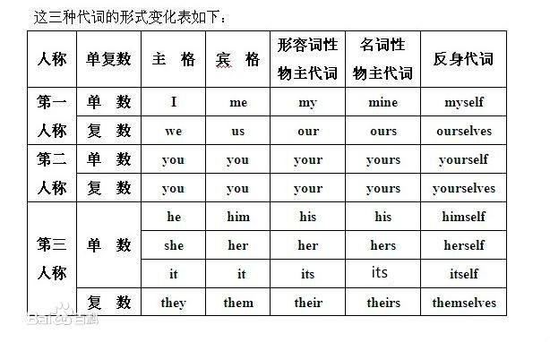

# 复数

## 复数主语和be动词的连用
* we are very happy.
* you are good friends.
* THey are major competitors.
* whales are mammals.
* peter and mary are coworkers.

## 可数名词的复数
* a/an 单数可数名词　-> 复数可数名词
* a book -> books
* an apple -> apples
* a pen -> pens
* a class -> classes
* a baby -> babies

 可数名词指可以一个一个分开的名词，分为单数名词和复数名词．
* 像water,air,houmor这类无法分开的名词，称为不可数名词，不可数名词做主语时，应该接单数动词．

### 可数名词复数的变化规则
* 一般：+s. boy -> boys, school -> schools, pen -> pens
* 字尾为s,x,z,sh,ch: +es. fox -> foxes, dish -> dishes, watch -> watches.
* 字尾为f,fe: 多数+s,少数去掉f+ves. leaf ->leaves,knife -> knives
* 字尾为y: 多数 去y+ies ,+s. baby ->babes,story -> stories

## be动词的否定
* be动词＋not，表示中文的＂不是＂．

**句型总结**

* 复数主语 ＋ be动词 ＋ 形容词/复数可数名词．
* 复数主语 ＋ be动词 ＋ not + 形容词/复数可数名词．
* 人称代词 ＋ be动词 ＋ not + 形容词/名词．

## 常见的人称代词
